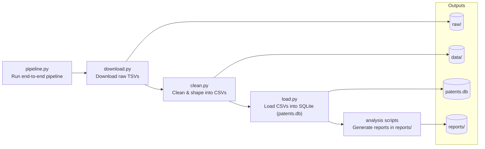

# Patent Data Pipeline + Dashboard

This project implements a simple ELT pipeline for US patent filings from the PatentsView (USPTO) datasets. It extracts raw TSVs, loads them into SQLite, and uses analysis scripts to generate reports for the dashboard.

## Pipeline overview



## Requirements

- Python 3.10+
- Packages listed in `requirements.txt`

Install dependencies:

```bash
pip install -r requirements.txt
```

## Quick start (pipeline)

Run the end-to-end pipeline from the project root:

```bash
python pipeline.py
```

This executes download, clean, load, and analysis steps in order.

NOTE: The analysis scripts can take a long time to run. For most runs, it is
recommended to skip analysis and execute each analysis file separately when
you are ready.

Skip analysis:

```bash
python pipeline.py --skip-analysis
```

Run selected analyses:

```bash
python pipeline.py --analysis core,cpc,weighted
```

## Analysis outputs

Analysis is run via standalone scripts and writes CSV/JSON files to `reports/`.

NOTE: These scripts are heavy and may take a long time. For best results, run
the pipeline with `--skip-analysis` and execute each analysis script one by one
at your own convenience.

Example:

```bash
python analysis_01_core.py
```

## Analysis index

1. `analysis_01_core.py` — core KPIs, top companies/inventors/countries, and patent trends
2. `analysis_02_cpc.py` — CPC sections, growth by decade, top company per section
3. `analysis_03_weighted.py` — citation-weighted rankings (H-index, citations, normalized scores)
4. `analysis_04_displacement.py` — displacement diagnostics (smartphones, EVs, AI, clean energy)
5. `analysis_05_geopolitical.py` — geopolitical comparisons (US vs China, trade war semiconductors, KR vs JP)
6. `analysis_06_trends.py` — infrastructure and telecom trend lags (chips vs software, infra vs mobile, 3G/4G/5G)
7. `analysis_07_country.py` — country policy growth, top country per CPC, innovation efficiency
8. `analysis_08_company.py` — company diagnostics (IBM vs Samsung, volume vs quality, KR vs CN citations)
9. `analysis_09_fin.py` — sector guardrails (fintech vs banking, genomics vs pharma, ecommerce vs retail)
10. `analysis_10_trend_other.py` — media/energy trends (streaming vs optical, renewables vs fossil, battery vs oil)
11. `analysis_11_predictive_analysis.py` - predictive analytics section

## Dashboard

Start the Flask dashboard:

```bash
python dashboard/app.py
```

Open:

- http://172.20.10.2:5000
## Project outputs

- `raw/`: downloaded TSV files
- `data/`: cleaned CSV files
- `patents.db`: SQLite database
- `reports/`: analysis outputs (CSV + JSON)


